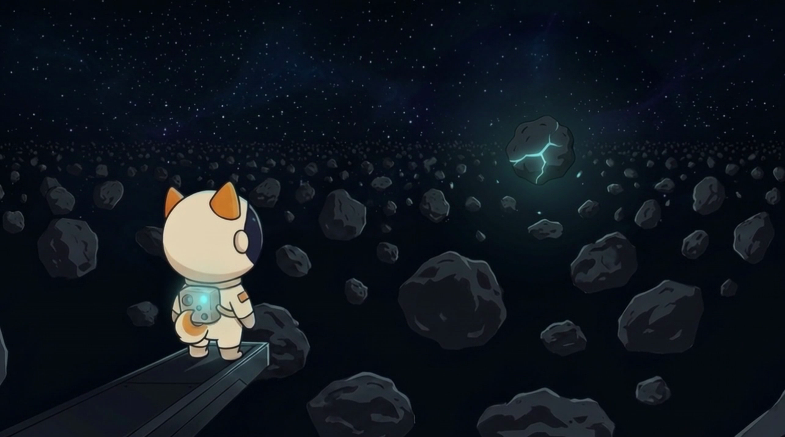

# What is Asteroid Shiba

**Asteroid Shiba is a space gold-rush game inside Telegram.** Every season, a limited number of valuable asteroids exist somewhere in the field. You send out signals, scan the void, and hunt for them. Find one first — and it's yours for the whole season, quietly earning rewards.

The fantasy is simple: **you're an explorer who found the gold vein before anyone else.**

## The loop, in one line

> Send a signal → scan → discover an asteroid → collect rewards → upgrade → hunt again.

Some asteroids are empty rock. A few hold real value — Common, Rare, Epic, Legendary, and the almost-mythical **Genesis**. The rarer the find, the bigger the reward, and the fewer that exist in the whole season.

## What makes it different

* **Ownership.** A valuable asteroid you find stays in your portfolio and keeps earning until the season ends — you're building a mining fleet, not chasing a single prize.
* **Fair odds for everyone.** Every rarity exists for every player from day one. Upgrades only shift your _chances_ — a brand-new player can still, in theory, strike Genesis.
* **A real network.** Invite explorers and your network carries into the game, boosting your start and your odds.

## Where to next

* New here? Start with [**How it works in 60 seconds**](welcome/how-it-works.md).
* Ready to play? [**Claim your Shiba**](getting-started/claim.md).
* Curious about the story? [**The Story**](welcome/story.md).
