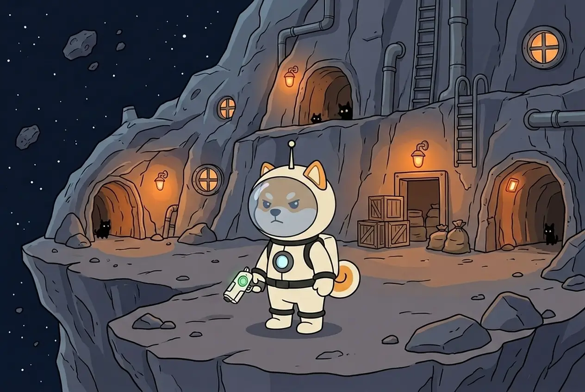

# What is Asteroid Shiba



**Asteroid Shiba is a space game inside Telegram.** Your Shiba flies out to asteroids, brings home valuable loot, and you turn it into ASTRO.


**The Season 2 prelaunch is live now.** You can already move in — see [Joining Season 2](season-2/joining.md).


## Season 2 — The Occupied Belt

In Season 1 the system was empty: you found asteroids and kept them. In Season 2 the asteroids are **occupied** — colonies of Tenants moved in first. An asteroid can't be taken anymore, so Shiba **raids** them: she flies in, gets through up to three scenes, and flies home with what fits in her backpack.

```
Shiba flies on schedule → up to three scenes → loot home → ASTRO & CARGO → better gear → again
```

## What makes it different

* **She plays, you decide.** Shiba flies on her own, five departures a day in the schedule. You choose what she carries, what the workshop builds, and read her journal.
* **Pistol and Backpack.** The Pistol decides how much she gets; the Backpack decides how much makes it home.
* **Real rewards.** ASTRO is withdrawable as USDT (BEP20). The leaderboard is the top 100 by ASTRO earned.
* **A real network.** Invite explorers and earn a commission on every purchase they make.

## Where to next

* New here? [How it works in 60 seconds](welcome/how-it-works.md).
* The whole season: [Season 2 at a glance](season-2/overview.md).
* The story: [The Occupied Belt](season-2/story.md).
* Joining: [Joining Season 2](season-2/joining.md).
