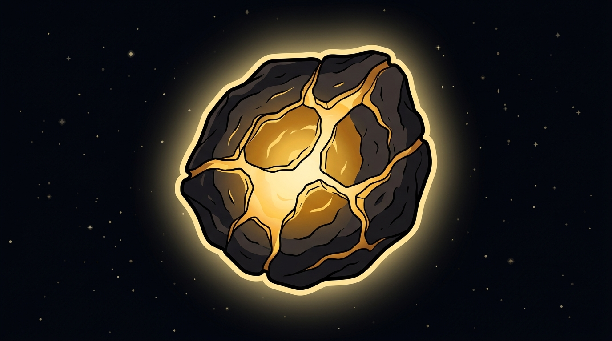

# Genesis explained

**Genesis is the rarest, most valuable asteroid in the game** — the "I found the gold vein before anyone else" moment the whole game is built around.

## What makes Genesis special

Just three things:

1. **The rarest class** — only a handful exist in a whole season.
2. **The highest reward** — the biggest instant Discovery payout and the highest daily mining income of any asteroid.
3. **The highest prestige** — the ultimate Explorer flex.

## What Genesis is _not_

There are **no special mechanics** after you find one — no special perks, no titles, no secret modes. A Genesis follows the exact same rules as every other asteroid: it joins your portfolio, mines ASTRO, and can be improved with Research. The magic is entirely in finding it.

## Who can find it

**Anyone** — including a free player. Genesis is never gated behind a Scanner level. There is one condition: Genesis only becomes findable **after a certain point in the season** (a time-gate), so the earliest days build anticipation before the rarest prize appears. After that, your Scanner and network only affect your _odds_ — never your access.

**Next:** [What the Scanner does →](../scanner/overview.md)
