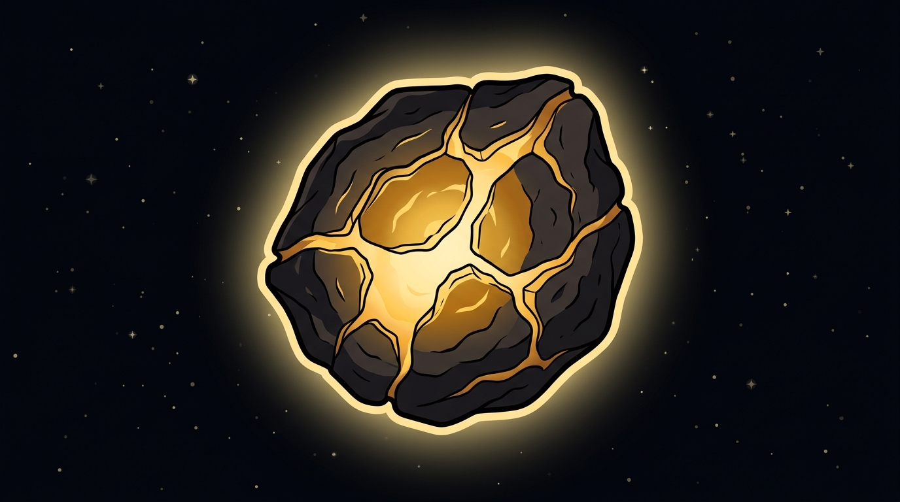

# Genesis explained

**Genesis is the rarest, most valuable asteroid in the game** — the "I found the gold vein before anyone else" moment the whole game is built around.

## What makes Genesis special

Just three things:

1. **The rarest class** — only a handful exist in a whole season.
2. **The highest reward** — the biggest instant Discovery payout and the highest daily mining income of any asteroid.
3. **The highest prestige** — the ultimate Explorer flex.

## What Genesis is _not_

There are **no special mechanics** after you find one — no special perks, no titles, no secret modes. A Genesis follows the exact same rules as every other asteroid: it joins your portfolio, mines ASTRO, and can be improved with Research. The magic is entirely in finding it.

## Who can find it

**Any explorer with a Level 1 Scanner or higher.** Genesis is not findable at Level 0 at all — it becomes reachable from **Level 1** up, and from there the higher your Scanner level, the better your _odds_. Genesis is also time-gated: it becomes findable **after a certain point in the season**, so the earliest days build anticipation before the rarest prize appears.

## Season 1

Season 1 held a pool of **five Genesis asteroids, and all five were found.** The season is complete — see [Seasons & leaderboard](../seasons/overview.md).

**Next:** [What the Scanner does →](../scanner/overview.md)
