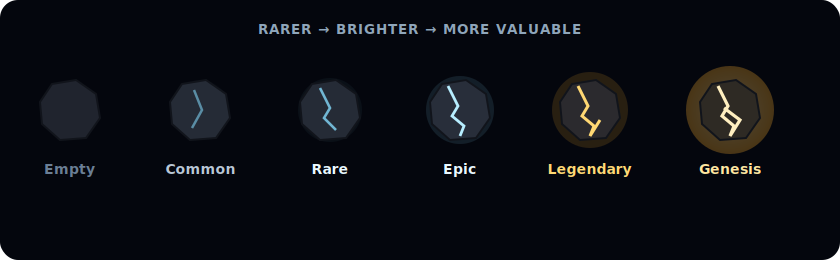

# Rarity tiers

Every asteroid you find belongs to one of six classes. The rarer the class, the bigger the reward — and the fewer that exist in the whole season.

| Tier          | What it means                                                             |
| ------------- | ------------------------------------------------------------------------- |
| **Empty**     | No asteroid — just empty space. Most scans land here.                     |
| **Common**    | The everyday find.                                                        |
| **Rare**      | A solid strike.                                                           |
| **Epic**      | Genuinely valuable.                                                       |
| **Legendary** | A jackpot moment — rare enough to feel special.                           |
| **Genesis**   | The top tier. Vanishingly rare, highest reward. [Read more →](genesis.md) |

## The key idea

Every rarity exists for **every player from day one**. A brand-new explorer can, in theory, strike Legendary or even Genesis — the odds are just far lower than for someone with an upgraded Scanner. Nothing is locked behind a paywall; upgrades only shift probability.

See exact rewards in [**What each is worth**](values.md).

**Next:** [What each is worth →](values.md)
