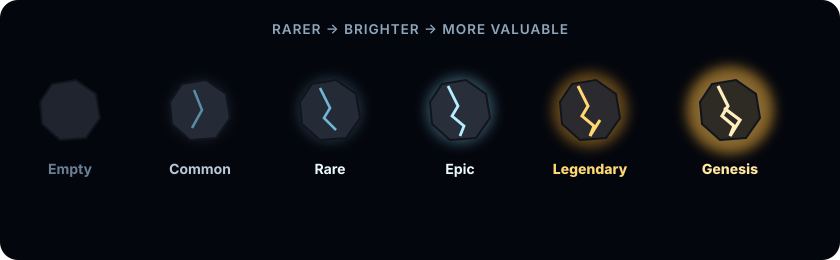

# Rarity tiers

Every asteroid you find belongs to one of six classes. The rarer the class, the bigger the reward — and the fewer that exist in the whole season.

| Tier          | What it means                                                             |
| ------------- | ------------------------------------------------------------------------- |
| **Empty**     | No asteroid — just empty space. Most scans land here.                     |
| **Common**    | The everyday find.                                                        |
| **Rare**      | A solid strike.                                                           |
| **Epic**      | Genuinely valuable.                                                       |
| **Legendary** | A jackpot moment — rare enough to feel special.                           |
| **Genesis**   | The top tier. Vanishingly rare, highest reward. [Read more →](genesis.md) |

## The key idea

**Level 0** can find Common, Rare and Epic — but only Common earns there; Rare and Epic wait in [storage](../lv0/storage.md) until you upgrade. From **Level 1** up the full range opens, Legendary and Genesis included, everything you find is live immediately, and each higher level shifts the odds further toward the rarest finds. What your Scanner never changes is the reward: a given find pays the same to everyone.

See exact rewards in [**What each is worth**](values.md).

**Next:** [What each is worth →](values.md)
