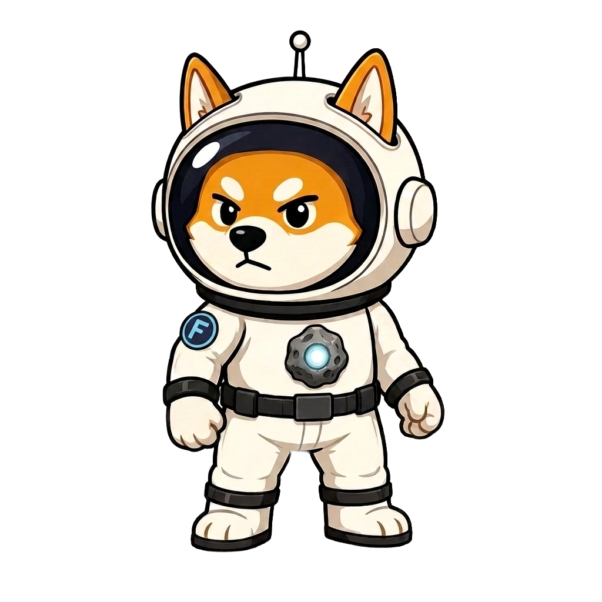

# Founder Phase


**The Founder Phase is closed.** It ran until Season 1 launched on **July 24, 2026**. The Founder Shiba can no longer be claimed. This page is kept as a record.


Before the game launched, Asteroid Shiba ran a **Founder Phase** — a limited window for early adopters to get in first.

## Founder Shiba — free, forever exclusive

Explorers who joined during that window claimed a **Founder Shiba**, an exclusive in-game mascot, for **free**. It will never be available again.

## Build your network before launch

The referral program is **already live**. Every explorer you invite now:

* carries into the game from **day one**,
* gives you a **stronger start**,
* and improves your **find-chance** through the [Explorer Network bonus](../referral/explorer-bonus.md).

Founders who build their network early start the season far ahead.

## Launch

**Asteroid Shiba launched on July 24, 2026.** Season 1 is running now.


Joining is still free: a new explorer claims a **Level 0 Shiba** at no cost. Free entry closes on **August 6, 2026**, after which game access becomes paid. Numbers are limited and it may close earlier. See [Claim your Shiba](../getting-started/claim.md).


**Next:** [FAQ →](../reference/faq.md)
