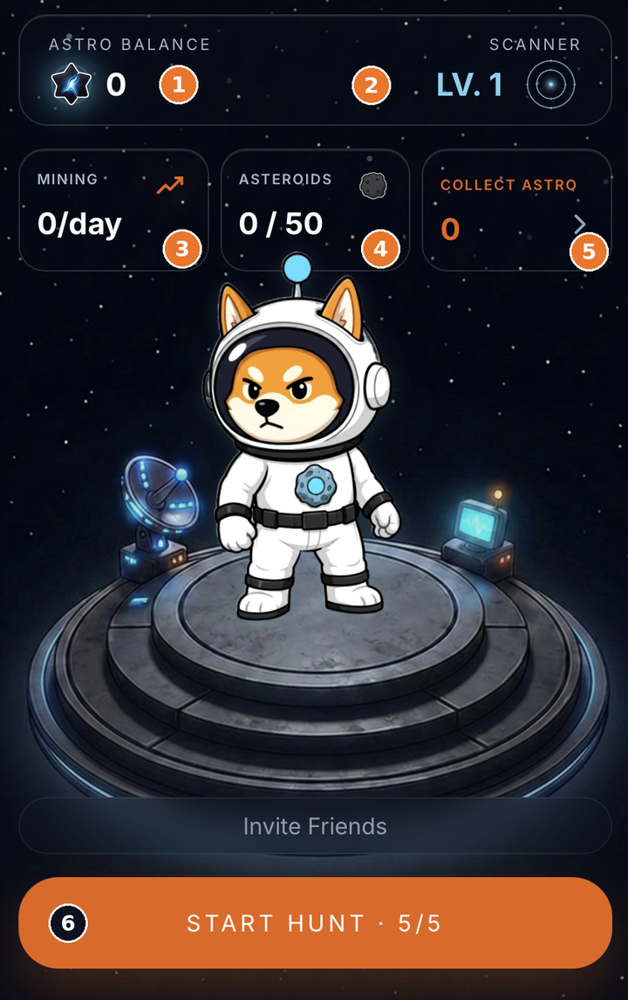
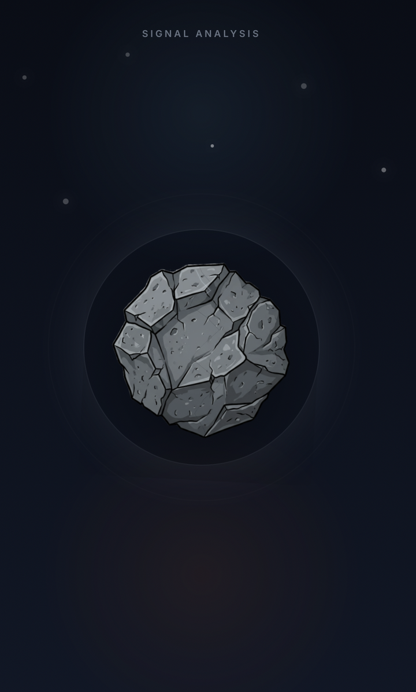
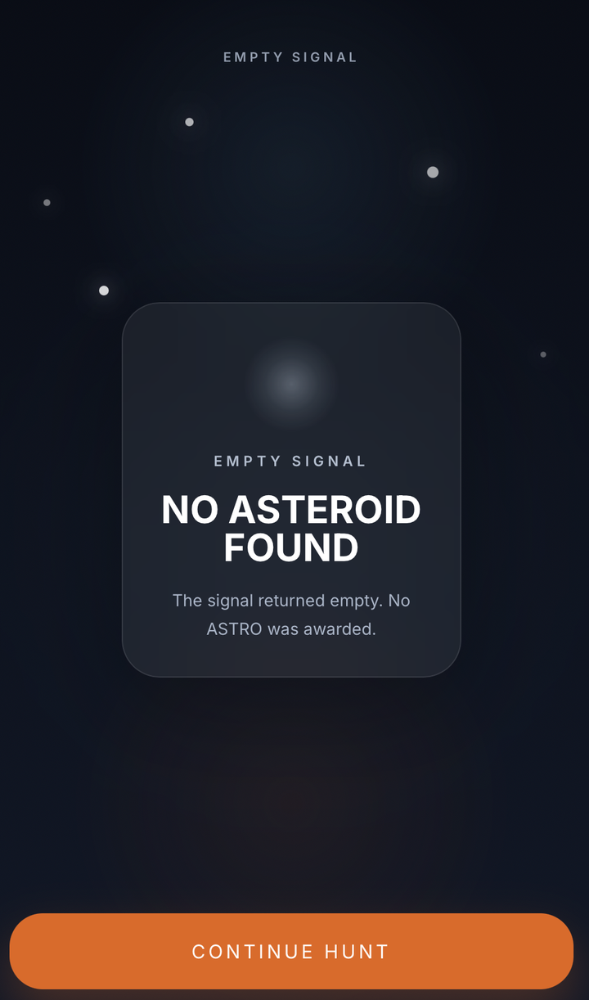
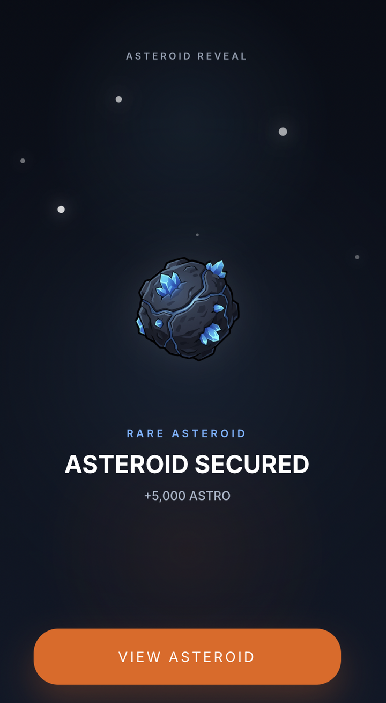
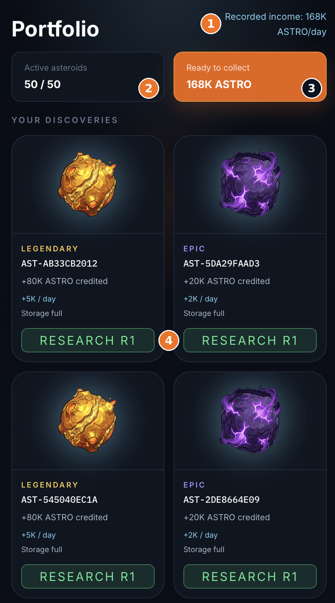
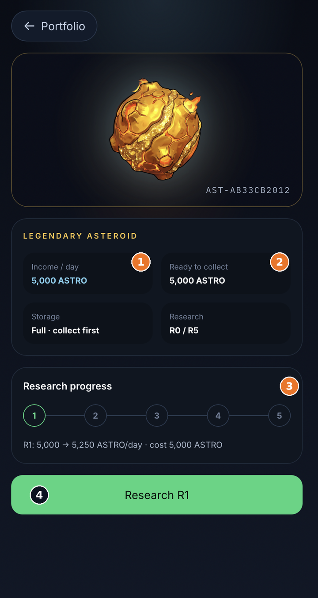
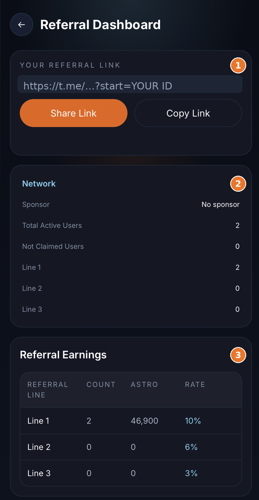

# Your first hunt

You've claimed your Shiba — now let's actually play. This is one real session, start to finish. It takes about a minute, and once you've done it once you know the whole game.


Every screen below is the real Mini App. The orange numbers (①, ②, …) point to the counters and buttons named underneath each image.


## 1. Your home base

Everything starts on one screen. Your Shiba stands on the launch platform, your stats sit across the top, and the big orange button is how you play.

<figure><figcaption>
① ASTRO BALANCE — your banked tokens · ② SCANNER — your account-wide level · ③ MINING — how much ASTRO your fleet earns per day · ④ ASTEROIDS — fleet size out of the 50 cap · ⑤ COLLECT ASTRO — mined tokens waiting to be banked · ⑥ START HUNT · 5/5 — signals left today
</figcaption></figure>

A brand-new explorer looks exactly like this: balance 0, Scanner LV. 1, no asteroids — and **five free signals**. Everyone starts on the same footing.

## 2. Send a signal

Tap **START HUNT**. One signal is spent and the scan begins: **SIGNAL ANALYSIS**.

<figure><figcaption>
One tap = one signal. Your counter drops from 5/5 to 4/5.
</figcaption></figure>

## 3. Most signals come back empty — and that's the point

Space is mostly empty rock. Plenty of scans return nothing, at every Scanner level.

<figure><figcaption>
EMPTY SIGNAL · NO ASTEROID FOUND. Tap CONTINUE HUNT and spend the next one.
</figcaption></figure>

The game tells you plainly: *"The signal returned empty. No ASTRO was awarded."* That scarcity is exactly what makes a real find feel like striking gold instead of collecting a daily bonus.

## 4. A find! The reveal

When a signal hits, the rock resolves out of the dark and the screen says **ASTEROID SECURED** — with its **rarity** (Common, Rare, Epic, Legendary, or the almost-mythical **Genesis**) and the ASTRO credited to you on the spot.

<figure><figcaption>
ASTEROID REVEAL · a Rare find pays +5,000 ASTRO instantly. Tap VIEW ASTEROID to open it.
</figcaption></figure>

Discovery pays immediately, and the asteroid is yours for the whole season. The same asteroid pays the same to every player: your Scanner changes your **odds** of finding a rare one, never the **reward** for finding it.

## 5. It joins your fleet — and mines for you

Open **Portfolio** to see everything you've found. Each asteroid quietly mines ASTRO into its own storage; you tap to collect.

<figure><figcaption>
① Recorded income — what your whole fleet earns per day · ② Active asteroids — 50 is the season cap · ③ Ready to collect — tap to bank it · ④ RESEARCH R1 — upgrade this specific asteroid
</figcaption></figure>

Two things worth knowing from this screen. Storage is finite — an asteroid that says **Storage full** has stopped mining until you collect, so a daily visit keeps the whole fleet working. And rarity is income: the Legendary above pays **+5K / day**, the Epic **+2K / day**.


The fleet shown here belongs to a test account that is already full at 50/50. Yours starts at 0 / 50 and grows one find at a time.


## 6. Make an asteroid earn more — Research

Tap any asteroid to open it. This is where **Research** lives: you burn ASTRO to permanently raise that rock's daily income.

<figure><figcaption>
① Income / day — what it pays now · ② Ready to collect — its uncollected balance · ③ Research progress — five levels, R0 → R5 · ④ Research R1 — the exact cost and the exact result are shown before you commit
</figcaption></figure>

Nothing is hidden and nothing is random: the line reads **R1: 5,000 → 5,250 ASTRO/day · cost 5,000 ASTRO**. Five levels take one asteroid up to **+50%** daily income, and every ASTRO spent is burned — permanently removed from circulation.

Research upgrades one asteroid. Your **Scanner** is the other half: it's account-wide and tilts the odds of every future hunt toward rarer finds. One improves what you already own, the other improves what you're about to find.

## 7. Bring your crew

Your referral network isn't a side quest — it pays in ASTRO across three lines.

<figure><figcaption>
① Your personal invite link — share or copy it · ② Network — your sponsor and how many explorers sit on each line · ③ Referral Earnings — ASTRO earned per line at 10% / 6% / 3%
</figcaption></figure>

Line 1 pays **10%**, line 2 **6%**, line 3 **3%**. A crew keeps earning for you while you hunt.

***

That's the full loop: **signal → scan → discover → collect → research → repeat.** Everything else in this guide is detail on those six steps.

**Next:** [Signals & Hunting →](../gameplay/signals-hunting.md)
