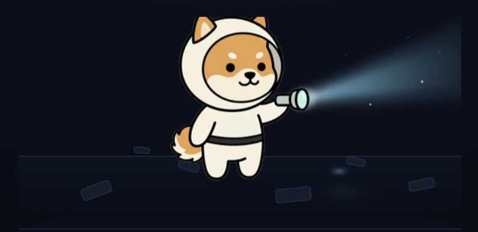
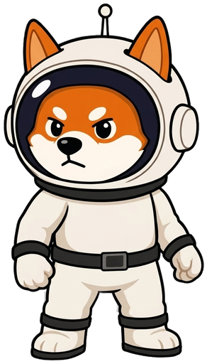

# Salvage Run

**A free shot at a Scanner Level 1, every two days.**

Out in the debris field there are Scanners that still work. Every second night a group of explorers goes looking, and one of them comes back with one. It costs nothing to join, and the next run is never more than two days away.

<figure><figcaption><p>Out in the debris field, looking for a Scanner that still works.</p></figcaption></figure>

## Who can join



**New explorers who have not started hunting yet.** If your hunt is already unlocked — whether you bought your Scanner or received one earlier — the Salvage Run is not for you. It exists to get new explorers off the ground, not to hand out second Scanners.

## The two conditions

Both are required. Neither is optional, and both are checked.

**1. Be subscribed to the developer channel** — [t.me/TheMasked_Dev](https://t.me/TheMasked_Dev)

This is verified automatically the moment you tap join. If you are not subscribed, you are not entered.

**2. Post `#salvagerun` in the community chat** — [t.me/asteroidshiba\_game](https://t.me/asteroidshiba_game)

One message with the hashtag **for every run you enter**. Enter three runs, post it three times. This one is not checked when you join — it is checked before the prize is handed over.


**Fewer hashtags than runs entered means no prize.**

If you win and the count does not match, the Scanner is not awarded. Post `#salvagerun` in the chat each time you join, and you have nothing to worry about.


## How a run works

```
Join (free) → the field fills up → the draw at 00:00 UTC → support verifies → Scanner Level 1
```

1. **Join.** One tap, once you are subscribed. You are counted in this run.
2. **Post the hashtag.** `#salvagerun` in the community chat, for this run.
3. **The draw.** Every second day at **00:00 UTC**. Exactly **one** explorer wins.
4. **The check.** Support confirms your subscription and counts your hashtag messages against the runs you entered.
5. **The Scanner.** Once confirmed, staff activate your **Scanner Level 1**.

## What you win

A working **Scanner Level 1** — the same one everyone else pays for. It is not a trial and it does not expire.

## How the prize reaches you

**It is not automatic.** If you win, you get a message in Telegram asking you to contact support at [@shiba\_asteroid](https://t.me/shiba_asteroid). Support runs the check described above and activates the Scanner.

Until that check is finished, your win stays open — and while it is open you cannot enter another run.

## If you don't win

Nothing is lost, and nothing carries over — each run is drawn on its own. Join the next one. There is one every two days, and joining is free.


One Scanner Level 1, once every two days, one winner per draw. The odds depend on how many explorers are out in the field with you.

