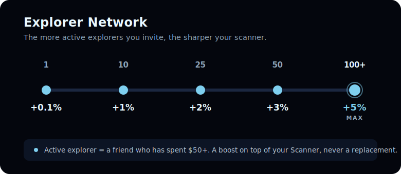

# Explorer Network bonus

Every **active explorer** in your network tunes your scanner. The bigger your active network, the higher your chance to find valuable asteroids — a boost that stacks on top of your Scanner.

## The ladder

| Active referrals | Find-chance bonus |
| ---------------- | ----------------- |
| 1                | +0.1%             |
| 10               | +1%               |
| 25               | +2%               |
| 50               | +3%               |
| **100+**         | **+5% (max)**     |

## How to read it

* **Milestones, not per-head.** You reach a tier once your active network hits that size. Think of them as goals: 10, 25, 50, 100.
* **Active only.** Only friends who've spent $50+ count. See [Rates & active referrals](rates.md).
* **Across every rarity.** The bonus lifts your overall find-chance, spread across all rarities from Common to Genesis.


The bonus is a **boost, never a replacement** for upgrading your Scanner. At the max, it's worth roughly a third of a Scanner level — a nice edge, not a shortcut. Hunting and upgrading stay the heart of the game.


**Next:** [Rarity tiers →](../asteroids/rarities.md)
