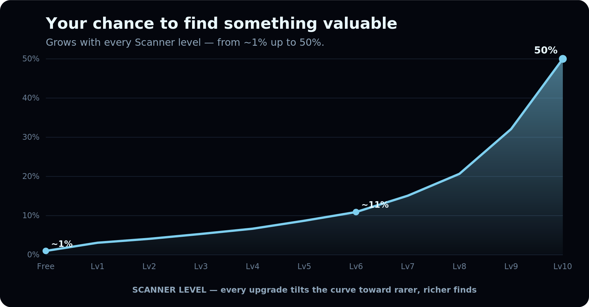

# Scanner odds

Your Scanner never locks a rarity behind a level — it shifts the **odds**. Here's how your chances grow as you climb.

## Key levels at a glance

| Scanner | Chance to find something | Rare or better | Epic or better | Jackpot (Legendary / Genesis) |
| ------- | ------------------------ | -------------- | -------------- | ----------------------------- |
| **Free** | ~1% | ~0.1% | — | — |
| **Lv3 · Hunter** | ~5% | ~1.2% | ~0.6% | ~0.1% |
| **Lv6 · Pro** | ~11% | ~5.9% | ~3.4% | ~0.4% |
| **Lv10 · Legend** | 50% | ~40% | ~22% | ~1.5% |

## How to read it

* **Every rarity is possible at every level** — even a free player can, in theory, strike Genesis. Upgrading only changes *how likely*.
* **Upgrading tilts the whole curve** toward rarer, more valuable finds — Epic goes from near-zero to roughly 1-in-5 scans at max.
* **Empty scans never fully disappear.** That scarcity is the point — a find should feel like *striking gold*, not collecting a daily bonus.


These are the Season 1 odds. Rarity balance may be tuned between seasons.


**Next:** [How Research works →](../research/overview.md)
