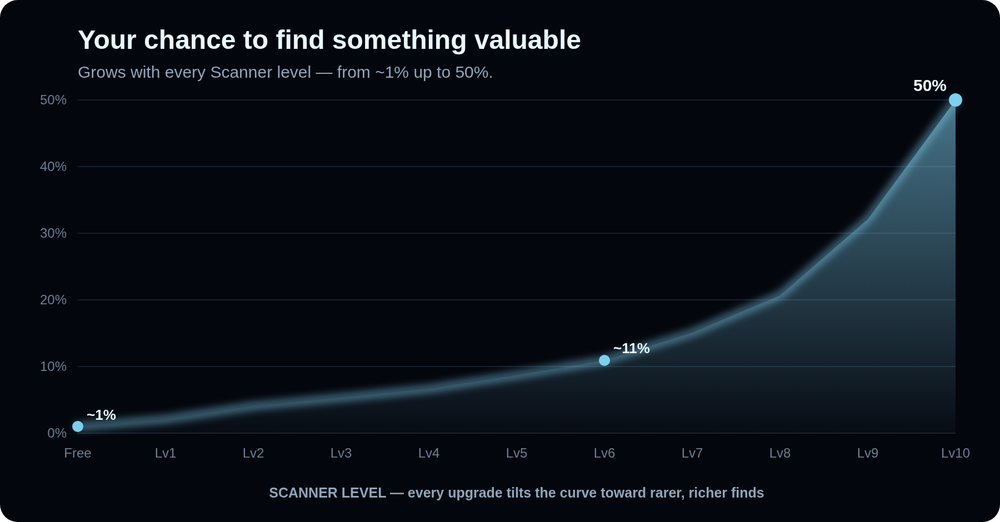

# Scanner odds

Your Scanner shifts the **odds** — and opens rarer tiers as you climb. Level 0 can find Common, Rare and Epic; Level 1 and up unlock the full range and tilt the whole curve. Here's how your chances grow.

## Every level, every rarity

Chance per signal. **Empty is the rest of each row** — at Level 0 that's 99.31%, at Level 10 it's 50%.

| Lv | Common | Rare | Epic | Legendary | Genesis |
| -- | ------ | ---- | ---- | --------- | ------- |
| **0 · Entry** | 0.60% | 0.07% | 0.02% | 0% | — |
| **1** | 1.98% | 0.07% | 0.02% | 0.01% | 0.0025% |
| **2** | 3.52% | 0.32% | 0.16% | 0.08% | 0.0050% |
| **3 · Hunter** | 4.10% | 0.62% | 0.47% | 0.11% | 0.0100% |
| **4** | 4.40% | 1.04% | 1.05% | 0.16% | 0.0200% |
| **5 · Pro** | 4.91% | 1.69% | 1.84% | 0.23% | 0.0300% |
| **6** | 5.03% | 2.53% | 2.98% | 0.33% | 0.0400% |
| **7 · Elite** | 5.87% | 4.08% | 4.61% | 0.47% | 0.0500% |
| **8** | 6.32% | 6.37% | 7.21% | 0.67% | 0.0800% |
| **9 · Legend** | 8.86% | 10.86% | 11.32% | 0.95% | 0.1100% |
| **10** | 10.50% | 17.50% | 20.50% | 1.35% | 0.1500% |


**Genesis was in play in Season 1** — reachable from a Level 1 Scanner up, never at Level 0. Season 1 is now complete and all five Genesis asteroids of that season were found. See [Seasons & leaderboard](../seasons/overview.md).


## How to read it

* **Level 0 can find Rare and Epic, but not use them.** They are recorded as yours and held in [storage](../lv0/storage.md) — no instant reward, no daily income — until you reach Level 1. Only Common earns at Level 0.
* **From Level 1, every available rarity is reachable and active.** Legendary opens at Level 1. Upgrading never unlocks a rarity beyond that — it only changes *how likely* each one is.
* **Upgrading tilts the whole curve** toward rarer, more valuable finds — Epic goes from near-zero to roughly 1-in-5 scans at max.
* **Empty scans never fully disappear.** That scarcity is the point — a find should feel like *striking gold*, not collecting a daily bonus.


These are the Season 1 odds. Rarity balance may be tuned between seasons.



**Level 0 finds are not all equal.** A Common pays its 1,000 ASTRO instantly and the first one starts earning. A Rare or Epic found at Level 0 goes straight to storage: you keep it, but it pays nothing and earns nothing until you upgrade. See [Scanner Level 0](../lv0/overview.md).


**Next:** [How Research works →](../research/overview.md)
