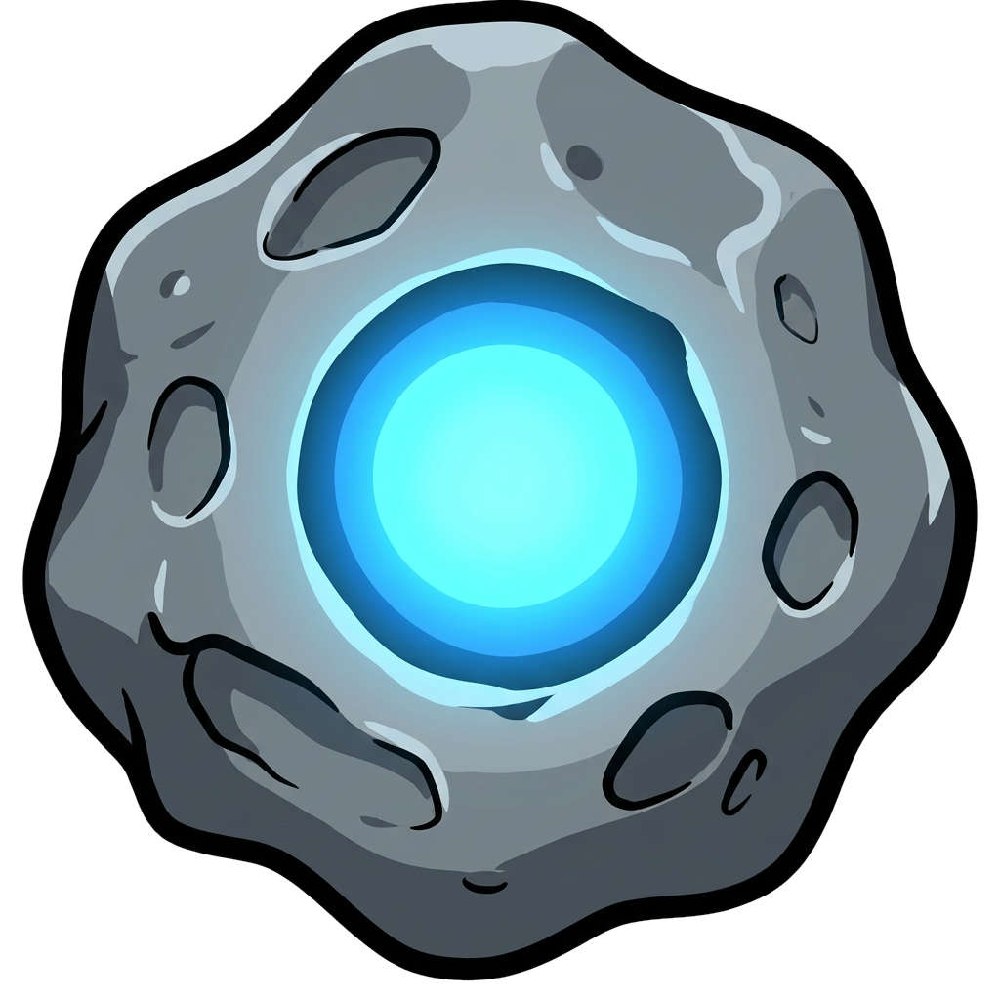

# What the Scanner does

Your **Scanner** is how you get better at hunting. It's the one upgrade path for your account — and it does exactly one thing.

## It opens rarities and shifts your odds

A free Scanner (Level 0) finds **Common**. From **Level 1** up, the full rarity range opens — Rare, Epic, Legendary and Genesis — and each level tilts the whole find-curve further toward the rarer, more valuable asteroids.

One thing the Scanner never touches: **what an asteroid is worth**. The same find pays the same to everyone — your level changes how *often* and how *rare* your finds are, never the reward.

## The five ranks

The Scanner climbs through 10 levels, grouped into five stages you can *feel*:

| Rank | Levels | The feeling |
| ---- | ------ | ----------- |
| **Novice** | 1–2 | Your own hunt, better than starting from zero. |
| **Hunter** | 3–4 | Rare stops being a rare event. |
| **Pro** | 5–6 | Epic becomes genuinely reachable. |
| **Elite** | 7–8 | Legendary feels like a real goal, not a lottery ticket. |
| **Legend** | 9–10 | The best rarity curve in the game. |

## Your rocket

As your Scanner climbs, your **rocket** upgrades to match — from a basic craft at Level 1 to the Genesis Rocket at Level 10. It's a cosmetic badge of how far you've come; it has no effect on the economy.

| Lv1 · Novice | | Lv10 · Legend |
| :---: | :---: | :---: |
|  | → |  |

_Your Scanner rig evolves as you climb — from the Novice-rank reader to the Legend-rank apex with the best find-curve in the game._

## Upgrade prices

Scanner upgrades are bought **one level at a time, in order** — each level unlocks the next, paid directly in **USDT (BEP20)**. There's no balance to top up: you buy the upgrade, you get it.

| Scanner | Rank | Price | Total to reach |
| ------- | ---- | ----- | -------------- |
| **Lv1** | Novice | 50 USDT | 50 USDT |
| **Lv2** | Novice | 75 USDT | 125 USDT |
| **Lv3** | Hunter | 100 USDT | 225 USDT |
| **Lv4** | Hunter | 150 USDT | 375 USDT |
| **Lv5** | Pro | 200 USDT | 575 USDT |
| **Lv6** | Pro | 250 USDT | 825 USDT |
| **Lv7** | Elite | 350 USDT | 1,175 USDT |
| **Lv8** | Elite | 500 USDT | 1,675 USDT |
| **Lv9** | Legend | 750 USDT | 2,425 USDT |
| **Lv10** | Legend | 1,000 USDT | 3,425 USDT |


Prices are in USDT on BNB Smart Chain (BEP20). **Level 0 is free** — every account starts there. "Total to reach" is the cumulative spend from Level 0.


## What it earns back

How long the ASTRO you earn takes to match what you spent, if you use all **5 signals every day**.

| Scanner | Total spent | Estimated break-even |
| ------- | ----------- | -------------------- |
| **Lv1** | 50 USDT | ~67 days |
| **Lv2** | 125 USDT | ~60 days |
| **Lv3** | 225 USDT | ~56 days |
| **Lv4** | 375 USDT | ~53 days |
| **Lv5** | 575 USDT | ~51 days |
| **Lv6** | 825 USDT | ~49 days |
| **Lv7** | 1,175 USDT | ~48 days |
| **Lv8** | 1,675 USDT | ~46 days |
| **Lv9** | 2,425 USDT | ~44 days |
| **Lv10** | 3,425 USDT | ~43 days |

**Legendary and Genesis are deliberately left out of these numbers.** They are jackpots — rare by design — and a break-even figure that depended on hitting one would tell you nothing useful. Everything above is built only on Common, Rare and Epic, so the jackpots are upside on top, never the plan.


These are **estimates, not guarantees**. They assume you spend all five signals every single day and hold your finds for the season; missed days push the number out. At the lower levels a find is rare enough that luck alone can move the result by weeks in either direction. Research is not counted here — it raises income further, on top.


**Next:** [Scanner odds →](odds.md)
