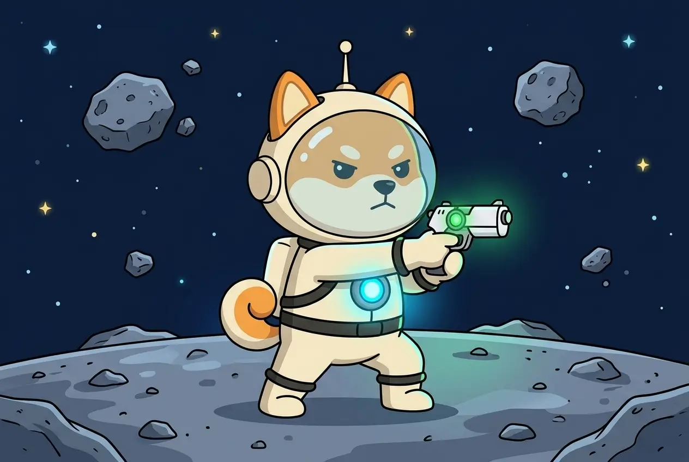
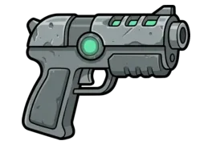
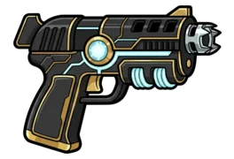
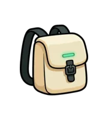
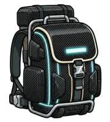

# The Arsenal

The Arsenal is where you upgrade the two things you pay for: the **Pistol** and the **Backpack**. Everything else Shiba wears is built by the base — see [Gear & the Workshop](gear-workshop.md).

| Pistol · Lv1 | | Pistol · Lv10 |
| :---: | :---: | :---: |
|  | → |  |

| Backpack · Lv1 | | Backpack · Lv10 |
| :---: | :---: | :---: |
|  | → |  |

## What each one does

* **Pistol** — the better it is, the more ASTRO every find is worth. It does not change CARGO, it does not help her get through a scene, and it does not open new places.
* **Backpack** — decides how much of the loot makes it home. A Backpack below the Pistol leaves part of the loot behind; a Backpack above the Pistol gives no extra.

## How much makes it home

| Backpack compared to Pistol | Share of loot delivered |
| --------------------------- | ----------------------- |
| same level or higher | **100%** |
| 1 level lower | 95% |
| 2 levels lower | 90% |
| 3 levels lower | 85% |
| each further level | −5% |

The Arsenal shows the current share and the share after the upgrade you are looking at. The game doesn't forbid any combination — how you split your budget between the two is your call.

## Prices

Prices are the **full value of a level**, in USDT (BEP20):

| Level | Pistol | Backpack |
| ----- | ------ | -------- |
| **Lv1** | 50 USDT | 10 USDT |
| **Lv2** | 125 USDT | 25 USDT |
| **Lv3** | 225 USDT | 45 USDT |
| **Lv4** | 375 USDT | 75 USDT |
| **Lv5** | 575 USDT | 115 USDT |
| **Lv6** | 825 USDT | 165 USDT |
| **Lv7** | 1,175 USDT | 235 USDT |
| **Lv8** | 1,675 USDT | 335 USDT |
| **Lv9** | 2,425 USDT | 485 USDT |
| **Lv10** | 3,425 USDT | 685 USDT |

**You only pay the difference.** The value of the level you already have is credited. You can skip levels: going from Pistol Lv1 to Lv3 costs 225 − 50 = **175 USDT**.

A **Pistol Lv0** has no credit value: from Lv0, Pistol Lv1 costs the full **50 USDT**.

## Buying

If you don't have a Backpack yet, your first purchase is **Backpack Lv1** — it unlocks the rest of the Arsenal.

1. Pick the item and the level. The Arsenal shows the full price, the credit and what you pay.
2. Pay the exact amount in **USDT on BNB Smart Chain (BEP20)** to the address shown.
3. The upgrade arrives when the payment is confirmed.

You can have **one open payment at a time**. If a payment expires unpaid, the Arsenal lets you get a new address, or go back and choose different gear.


Send funds only to the address shown for your current payment. Never send to an old, expired address — money sent there needs a manual check by support.


Your referrer earns a commission on every Arsenal purchase. See [Rates & active referrals](../referral/rates.md).

**Next:** [Gear & the Workshop →](gear-workshop.md)
