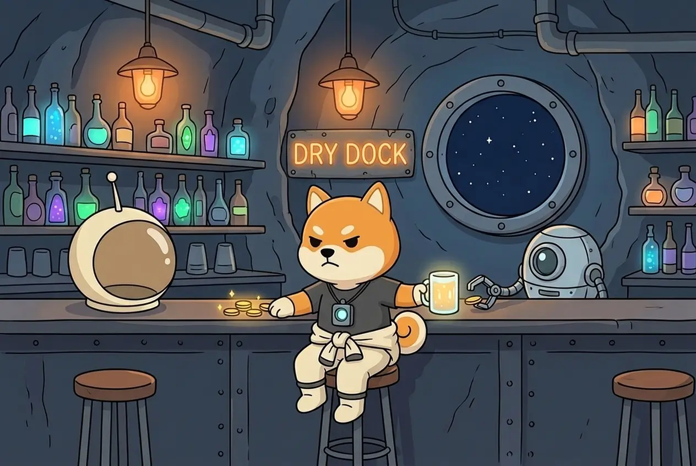

# The Bar

Shiba works every day, whether you look in or not. But if nobody talks to her all day, she spends the evening at the bar — the **Dry Dock**.

## The rule

If you **don't open the game at all during a UTC day**, that night Shiba spends **25–35% of the ASTRO she earned that day** at the bar. The exact share is random within that range.

* Only **that day's** ASTRO is affected — never your balance.
* **CARGO is never touched.**
* **Any visit counts** — one open of the game at any time before 24:00 UTC, even at 23:59.
* The bar is recorded in her journal the next time you look.


A skipped day can't be undone later: opening the game the next day doesn't bring back yesterday's ASTRO.


**Next:** [Joining Season 2 →](joining.md)
