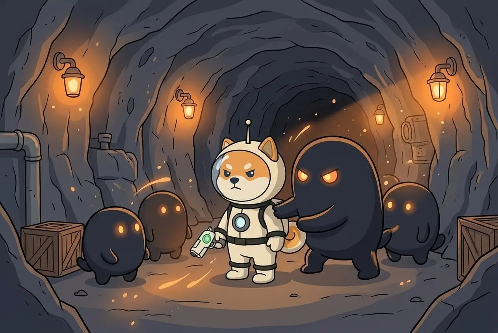
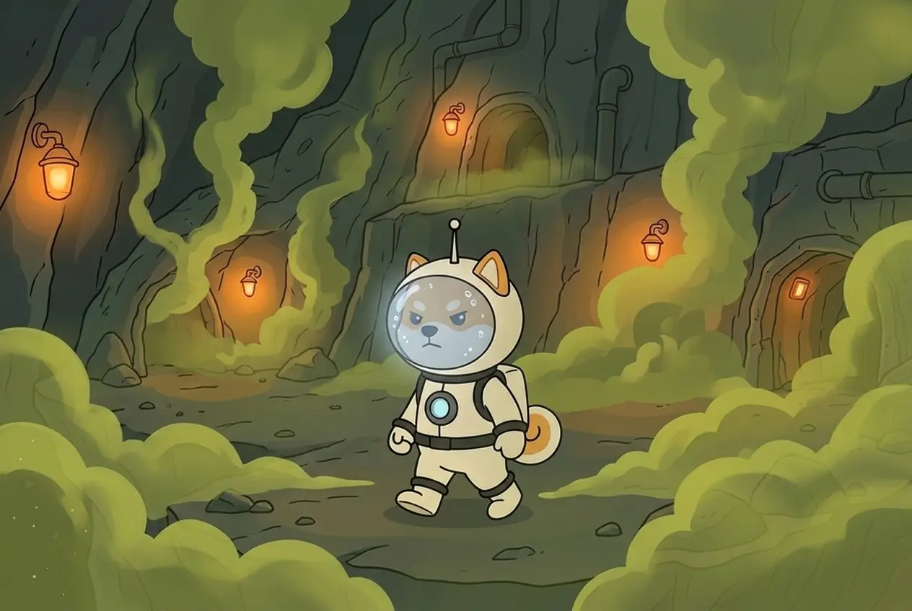
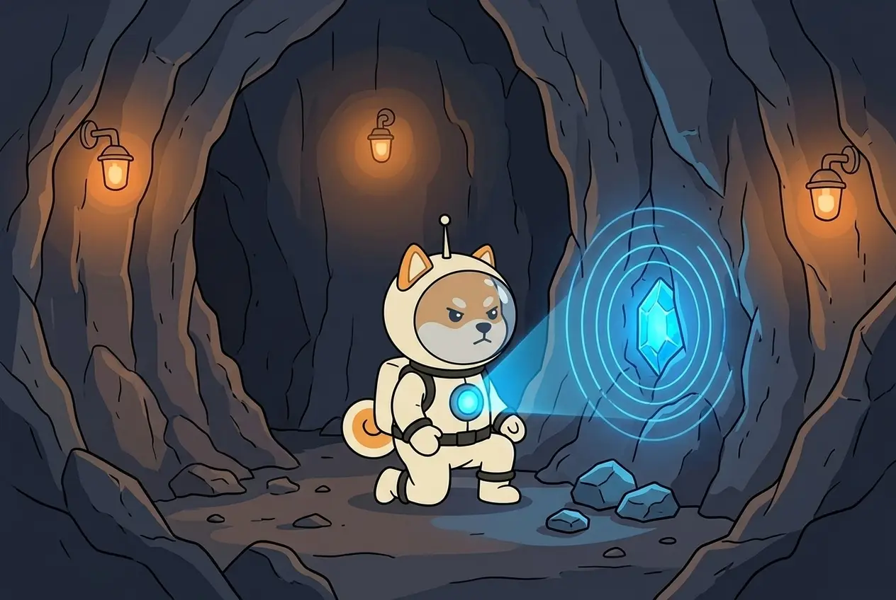
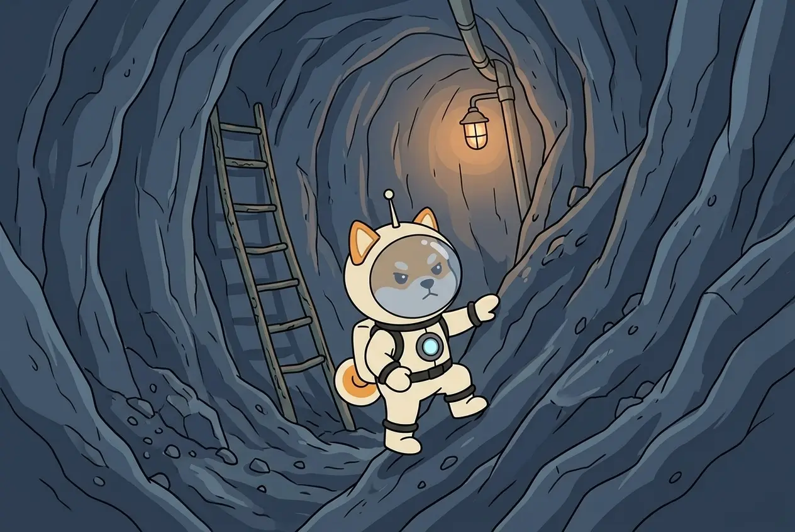
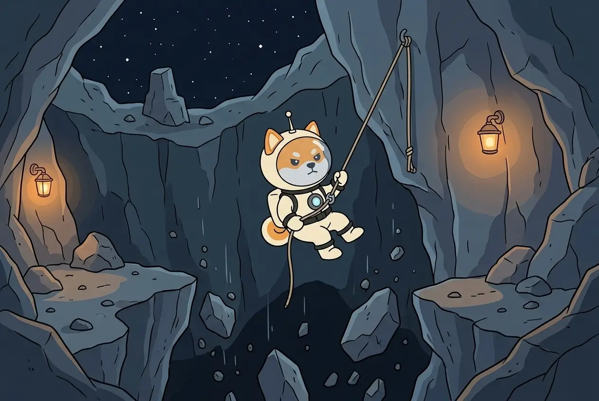
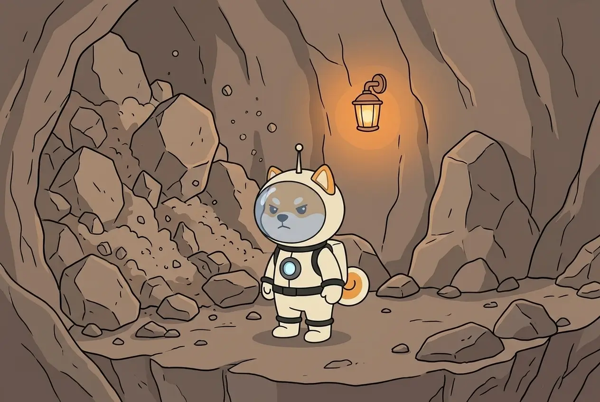

# Expeditions & schedule

Shiba flies on her own, on a fixed schedule. You don't press a button to launch her.

## The daily schedule (UTC)

There are **five departures in the schedule** every UTC day:

| Departure | Home |
| --------- | ---- |
| 00:00 | 03:15 |
| 03:30 | 06:45 |
| 07:00 | 10:15 |
| 10:30 | 13:45 |
| 14:00 | 17:15 |

**17:15 – 24:00 UTC is the evening** — the time for the workshop, her temper and tomorrow's order. See [Your role](your-role.md).

**00:00 UTC** starts a new day: tomorrow's order and anything the workshop finished take effect.


All times are UTC and the same for every player. You don't need to be online at a particular hour — open the game once per UTC day. See [The Bar](bar.md).


## One expedition, minute by minute

```
+0      departure
+0–60   flight to the asteroid
+60     landing, scene 1 — nobody has noticed her yet
+100    scene 2 — they've noticed, and they're coming
+140    scene 3 — the last one; after it she has to leave
+180    undocking
+195    home — the base unloads what she brought
```

## Scenes

On a full expedition there are **three scenes**. Each one is one of five kinds, and each kind tests one piece of her gear:

| Scene | What happens | Tested gear |
| ----- | ------------ | ----------- |
| **Clash** | somebody is not happy to see her | Suit |
| **Air** | toxic gas, cold, nothing to breathe | Helmet |
| **Find** | the moment you see what it was all for | Scanner |
| **Passage** | a tight tunnel to squeeze through | Boots |
| **Ledge** | the ground gives way under her paws | Rope |

| Clash · Suit | Air · Helmet | Find · Scanner |
| :---: | :---: | :---: |
|  |  |  |

| Passage · Boots | Ledge · Rope |
| :---: | :---: |
|  |  |

In every scene she tries to bring out a **core** or **ore**. Better gear in the right slot means a better chance to get through that kind of scene. See [Gear & the Workshop](gear-workshop.md).

## Setbacks

If a scene goes wrong, the expedition ends there: the colony blocks the tunnel or seals the way out. That is a **setback**.



* Whatever is **already in her backpack stays with her** and is delivered.
* She comes home **at the scheduled time**.
* She **skips the next departure** to recover. The journal shows it as rest, not as a gap.
* **Shiba never dies.** A setback is always an emergency return.

After a setback she becomes a little more careful; after a lucky run, a little bolder. See [Your role](your-role.md).

**Next:** [Loot: ASTRO & CARGO →](loot.md)
