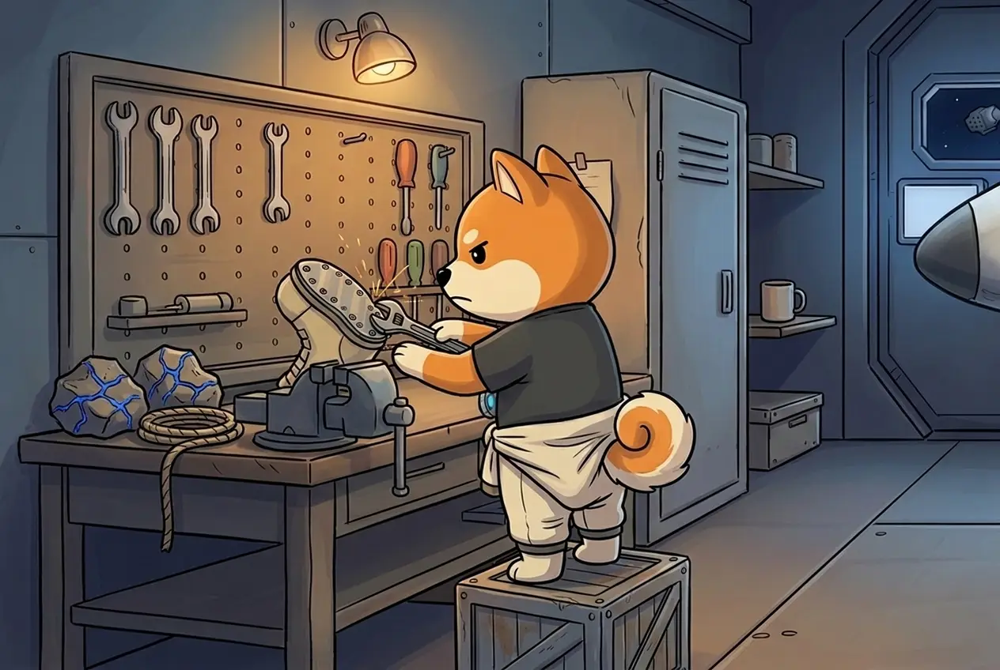

# Gear & the Workshop

## Five slots

From day one Shiba wears five pieces of gear, all at the basic stage:

| Gear | Scene it's tested in |
| ---- | -------------------- |
| **Suit** | Clash |
| **Helmet** | Air |
| **Scanner** | Find |
| **Boots** | Passage |
| **Rope** | Ledge |

Each piece has **three upgrade stages**. The higher the stage, the better her chance to get through that kind of scene. This gear decides *whether she gets through*; the [Pistol and Backpack](arsenal.md) decide *how much she brings home*.


This gear is **not sold for money**. The base builds every stage from the CARGO Shiba brings home. Gear never breaks and never needs repairs — it only gets better.


## The workshop

**It opens upgrades by calendar.** On set days of the season the workshop opens the right to order one more upgrade — **up to fifteen** in a season (five slots × three stages). How many open depends on how long the season runs. Opening doesn't depend on how many expeditions she flew or how much CARGO you have.

**You order one upgrade per UTC day.** A right opens at 00:00 UTC. You use it when you visit; unused rights don't expire, they wait for you.

**You pick from offers.** The workshop suggests what to build, based on the last two weeks of her journal — the gear that let her down comes first.

| Offer | Price |
| ----- | ----- |
| The workshop's top suggestion | base price |
| The slot you **pinned** | base price × 1.25 |
| The next suggestion | base price × 1.60 |

Base prices by stage: **30 → 60 → 170 CARGO**.

**It builds when there is CARGO.** In the evening the base works through the queue in order: whatever it can pay for gets built; an expensive order waits for more CARGO without blocking cheaper ones behind it. Several orders can be finished in one evening. A finished upgrade works **from the next day**.


Fifteen is the maximum the workshop can open, not a promise. Building every stage needs enough CARGO, and not every player will finish all fifteen.


**Next:** [Your role →](your-role.md)
