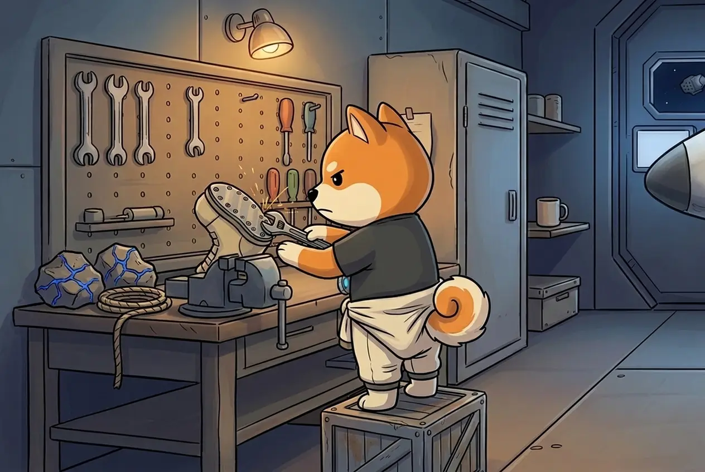

# Gear & the Workshop

## Five slots

From day one Shiba wears five pieces of gear, all at the basic stage:

| Gear | Scene it's tested in |
| ---- | -------------------- |
| **Suit** | Clash |
| **Helmet** | Air |
| **Scanner** | Find |
| **Boots** | Passage |
| **Rope** | Ledge |

Each piece has **three upgrade stages**. The higher the stage, the better her chance to get through that kind of scene. This gear decides *whether she gets through*; the [Pistol and Backpack](arsenal.md) decide *how much she brings home*.


This gear is **not sold for money**. The base builds every stage from the CARGO Shiba brings home. Gear never breaks and never needs repairs — it only gets better.


## The workshop

**Upgrade rights open on selected days of the shared Season 2 calendar.** These days are not evenly spaced and are not counted from the day you join. Up to fifteen rights can open (five slots × three stages). The rights calendar does not set an end date for the season. Opening doesn't depend on how many expeditions she flew or how much CARGO you have.

**A right opens at 00:00 UTC only if your gameplay access is active then.** Joining later or regaining access does not grant rights for earlier scheduled days. Rights already earned do not expire. You can place one upgrade order per UTC day.

The Workshop is available only while your Season 2 gameplay access is open. You need at least
Backpack Lv1; depending on when you joined, you may also need a purchased Pistol Lv1. If access
closes, you cannot place orders until you meet the Arsenal requirements. Gear, CARGO and rights
already earned remain.

**You pick from offers.** The workshop suggests what to build, based on the last two weeks of her journal — the gear that let her down comes first.

| Offer | Price |
| ----- | ----- |
| The workshop's top suggestion | base price |
| Second offer | base price × 1.25 |
| Third offer | base price × 1.60 |

Base prices by stage: **30 → 60 → 170 CARGO**.

If you pin a slot, it appears as the second offer. Pin nothing and the second offer is simply
the next slot down her journal — still at × 1.25. Pinning doesn't make an upgrade cheaper;
it decides *which* slot sits in that middle spot.

**It builds when there is CARGO.** In the evening the base works through the queue in order: whatever it can pay for gets built; an expensive order waits for more CARGO without blocking cheaper ones behind it. Several orders can be finished in one evening. A finished upgrade works **from the next day**.

Within one slot the stages are built in order: stage two waits for stage one, even when you
have the CARGO for it. Price never blocks a cheaper order — but a stage always waits for the
stage below it.


Fifteen is the maximum the workshop can open, not a promise. Building every stage needs enough CARGO, and not every player will finish all fifteen.


**Next:** [Your role →](your-role.md)
