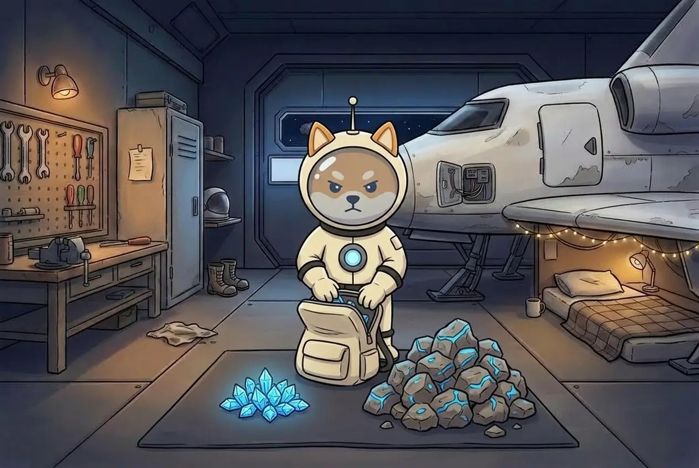

# Loot: ASTRO & CARGO



## What she finds, and what you get

On the asteroid Shiba finds two kinds of loot. When it reaches the base, it becomes what you see on your balance:

```
CORE   small, valuable             →  ASTRO
ORE    bulky, three times the size →  a little ASTRO + CARGO
```

* **ASTRO** — the main loot and the game's currency, the same as in Season 1.
* **CARGO** — material for the workshop. The base spends it to upgrade her gear.

At the same base value, ore takes three times the space of a core and brings a quarter of its ASTRO — but only ore brings CARGO.


**CARGO is not money.** It can't be sold, withdrawn or exchanged for ASTRO. Its only use is the [workshop](gear-workshop.md).


## Who decides how much

> **The Pistol decides how much she gets. The Backpack decides how much makes it home.**

* **Pistol** — the better it is, the more ASTRO every find is worth. It does **not** change CARGO.
* **Backpack** — if it is weaker than the Pistol, part of the loot stays on the asteroid. That cuts both ASTRO and CARGO.

The game shows you, before you buy, what share of the loot will make it home. See [The Arsenal](arsenal.md).

## What she carries first

Everything won't always fit. You set the order for tomorrow; it applies to all five departures of the day:

| Order | Room in the backpack, per expedition |
| ----- | -------------------------- |
| **Valuables** | 3 cores · 1 ore — more ASTRO |
| **Material** | 1 core · 2 ore — more CARGO |

Cores and ore have separate space: ore never pushes out a core. The order takes effect at 00:00 UTC; if you don't change it, yesterday's order stays. On day one it is **Valuables**.

**Next:** [The Arsenal →](arsenal.md)
