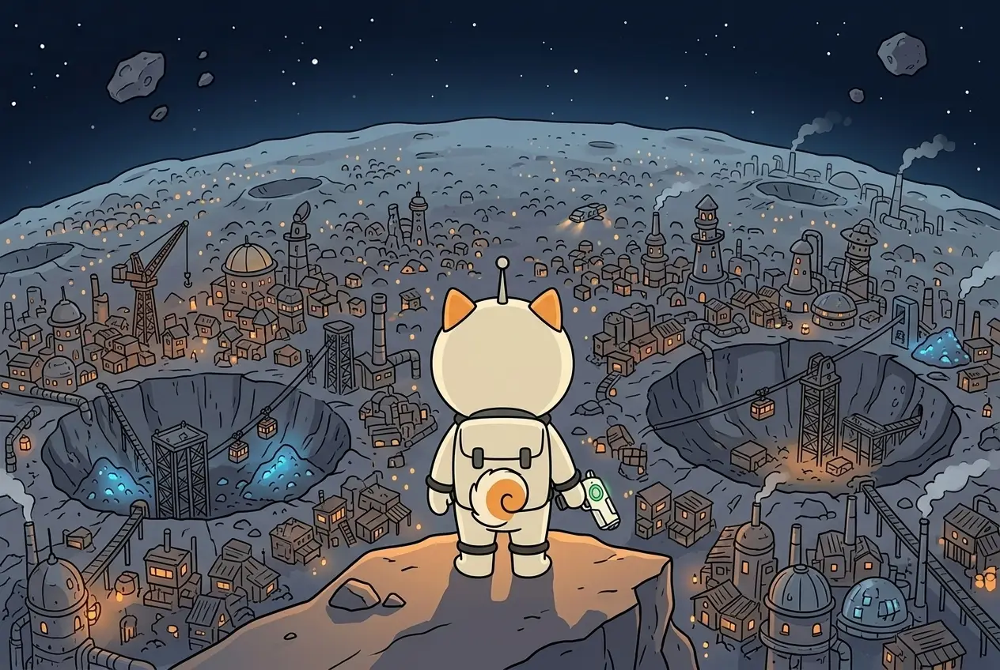

# The Occupied Belt

## Season 1 — the empty system

An asteroid with a valuable core sends out a signal — if you have something to catch it with. Shiba had a Scanner. She caught the signal, flew in and took the asteroid. One, then another, then a whole collection. Nobody could stop her: she was alone in the system.

Then the asteroids ran out. Every last one was found and emptied. The Scanner still works, but there is nothing left to hear. The system went quiet.

Shiba packed up her base and left to find a new one.

## Season 2 — the Belt

She found it. **THE OCCUPIED BELT** — the Belt, for short. The asteroids are the same: they send a signal, and there is a core inside.

But there is one difference, and it changes everything. **Someone already lives here.**



## The Tenants

We call them **the Tenants**. They arrived before Shiba, took the asteroids and work them for themselves — exactly what Shiba did last season. They are not leaving, and there is nobody to negotiate with.

The asteroids here are large: tunnels, storerooms, and not one creature but a whole colony on each.

So **an asteroid can no longer be taken.** Shiba is one; they are many. She can fly in and take part of what is there. She cannot stay.

## Why the Scanner split in two

In Season 1 the Scanner did two jobs at once: it found the core and cleared the way to it. In an empty system that was enough.

Now every asteroid is lived on. A device you fight with cannot listen at the same time, so it split:

```
SCANNER   stayed on her chest. It finds
PISTOL    went into her paw. It clears the way
```

> **The chest finds. The paw clears.**

## The window

The colony does not wait in ambush. It is busy with its own work, and when Shiba lands, nobody notices her at first. Then they notice, and start to gather.

While they gather, Shiba has time for **three scenes at most**. That is why a raid never lasts longer — and why a setback is not a lost fight: the colony does not beat her, it **cuts off the way out**. Shiba always comes home.

## Nobody knows where the Tenants came from

It looks like they flew in from somewhere too. Which means there is another system where something ran out.

**Next:** [Expeditions & schedule →](expeditions.md)
