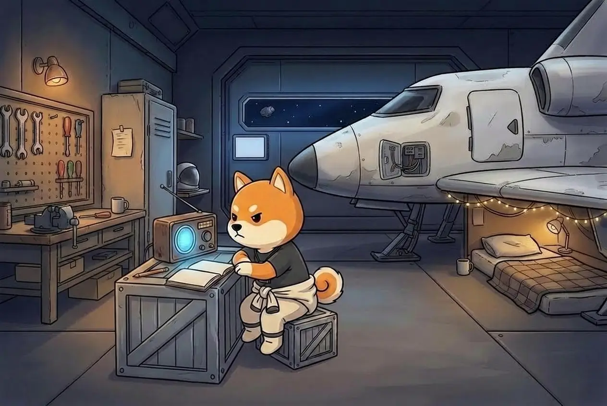

# Your role

You don't fly with Shiba and you don't steer her by hand. You are **the voice in her headset**.

## When you visit

* **Tomorrow's order** — Valuables or Material: what goes into the backpack first. See [Loot: ASTRO & CARGO](loot.md).
* **The workshop** — when a right is open, choose the next upgrade; pin the slot you care about. See [Gear & the Workshop](gear-workshop.md).
* **Her temper** — see below.

The evening, 17:15–24:00 UTC, after the last expedition is home, is the natural time for all three. Everything takes effect at 00:00 UTC.

## Her temper

Shiba has a character, and it moves on its own:

* after a **setback** she gets more careful — fewer setbacks, but she brings home less;
* after a **lucky risk** she gets bolder — more loot, but more setbacks.

**Evening correction.** If you opened the game during the UTC day and left the evening correction switched on, at 00:00 UTC her temper eases back a little toward her usual self. You can switch it off for today. If you didn't visit that day, there is no correction.

## The journal

Every expedition is written down: what she met, what she found, what made it home. In the morning you open the journal and read how it went.


Open the game at least **once per UTC day**. If you don't, Shiba spends the evening at [the Bar](bar.md).


**Next:** [The Bar →](bar.md)
