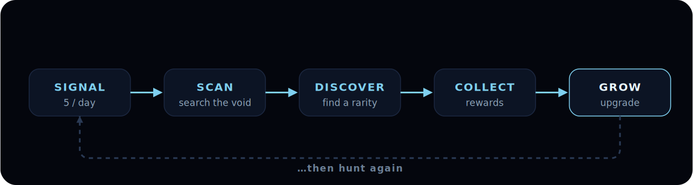

# How it works in 60 seconds

You don't need to read a manual to start. Here's the whole game in five steps.

### 1. You get signals

Every player gets **5 signals per day**, free. A signal is one attempt to scan the field and find an asteroid. No passes, no tiers — everyone hunts on equal footing.

### 2. You scan

Spend a signal and your Shiba scans the void. Most scans come back empty — space is mostly empty rock. But some light up.

### 3. You discover

When a scan hits, an asteroid is revealed with its **rarity**: Common, Rare, Epic, Legendary, or the ultra-rare Genesis. You get an instant reward the moment you find it.

### 4. It joins your portfolio

Every valuable asteroid you find **stays with you** and keeps generating rewards, day after day, until the season ends. The longer you play, the bigger your mining fleet — and the more it earns while you sleep.

### 5. You grow

Two ways to get stronger:

* **Scanner** — improves your *chances* of finding rarer asteroids.
* **Research** — increases how much a specific asteroid earns you.

And your **referral network** boosts your find-chance on top of that.

***

That's it. Send a signal, hunt, discover, collect, grow. Everything else in this guide is just detail on those five steps.

**Next:** [Claim your Shiba →](../getting-started/claim.md)
