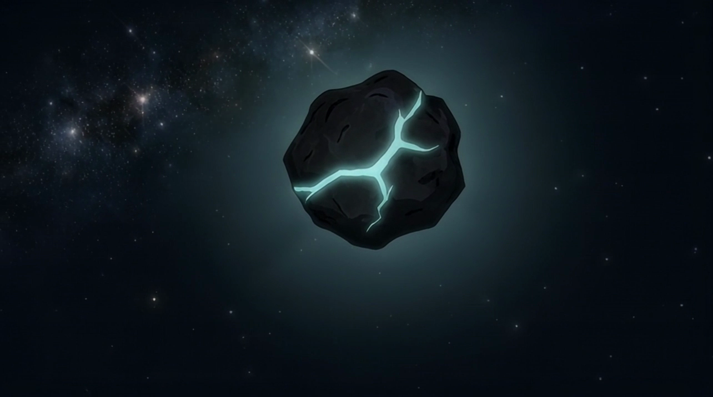

# The Story

Asteroid Shiba began with a real journey into space.

A plush Shiba named **Asteroid** — inspired by the little dog that captured the internet — travelled aboard the **Polaris Dawn** mission as its zero-gravity indicator, floating in orbit as the crew reached farther than any private spaceflight before it. That moment turned a small mascot into a symbol, and a community formed around the **$ASTEROID** idea: a space explorer for everyone chasing the frontier.

**Asteroid Shiba: the game** is the next chapter of that spirit — a community-built space gold-rush where anyone can become an explorer, hunt the void, and strike it rich.


Asteroid Shiba is a community project built around the $ASTEROID culture. It celebrates the explorer spirit that inspired it.


**Next:** [How it works in 60 seconds →](how-it-works.md)
